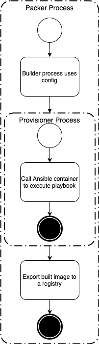

# Packer VirtualBox Ansible

This repo uses HCL instead of JSON templates to manage the packer build process. HCL provides greater control on dynamic logic for building different images. For the installation and configuration of the VM, Packer uses Ansible. Instead of the Ansible provisioner, this pattern uses Docker as the Ansible run time environment to invoke the playbook.



## Environment Variable

These are the environment variables to set before executing the Packer process. Some variables are required for specific builders and there are columns indicating which ones.

| Variable                            | Required   | Default Value                                                                                  | Builder: ephemeral-ansible-agent | Builder: local-ansible-agent | Description                                                                                                                  |
| ----------------------------------- | ---------- | ---------------------------------------------------------------------------------------------- | -------------------------------- | ---------------------------- | ---------------------------------------------------------------------------------------------------------------------------- |
| PKR_VAR_ansible_playbook_path       | Y          |                                                                                                |                                  | X                            | Ansible playbook path.                                                                                                       |
| PKR_VAR_docker_environment_variable | N          |                                                                                                | X                                | X                            | Environment variable used by docker. Format is '--env COOL_VAR1=VALUE1 --env COOL_VAR2=VALUE2'                               |
| PKR_VAR_docker_image_name           | Y          |                                                                                                | X                                | X                            | Docker image with the Ansible runtime environment.                                                                           |
| PKR_VAR_docker_mounted_volume       | N          |                                                                                                | X                                | X                            | Mount volumes needed to support the Ansible playbook process.                                                                |
| PKR_VAR_git_code_version            | Y          | master                                                                                         | X                                | X                            | Code version to use (branch or tag).                                                                                         |
| PKR_VAR_git_url                     | Y          |                                                                                                | X                                | X                            | Git repo URL.                                                                                                                |
| PKR_VAR_guest_os_type               | Y          | Debian_64                                                                                      | X                                | X                            | The guest OS type being installed.                                                                                           |
| PKR_VAR_image_cpus                  | Y          | 4                                                                                              | X                                | X                            | Image CPUs setting.                                                                                                          |
| PKR_VAR_image_disk_size             | Y          | 51200                                                                                          | X                                | X                            | Image disk size where the number value represents MB.                                                                        |
| PKR_VAR_image_description           | N          | Image Built By Packer                                                                          | X                                | X                            | Image description.                                                                                                           | 
| PKR_VAR_image_memory                | Y          | 8192                                                                                           | X                                | X                            | Image memory settings and the number value is in MB.                                                                         |
| PKR_VAR_image_name                  | Y          | packer                                                                                         | X                                | X                            | Image name.                                                                                                                  |
| PKR_VAR_image_version               | Y          | 0.0.0                                                                                          | X                                | X                            | Image semantic version built.                                                                                                |
| PKR_VAR_iso_checksum                | Y          | b317d87b0a3d5b568f48a92dcabfc4bc51fe58d9f67ca13b013f1b8329d1306d                               | X                                | X                            | The checksum for the ISO file or virtual hard drive file.                                                                    |
| PKR_VAR_iso_url                     | Y          | https://cdimage.debian.org/cdimage/release/10.7.0/amd64/iso-cd/debian-10.7.0-amd64-netinst.iso | X                                | X                            | A URL to the ISO containing the installation image or virtual hard drive (VHD or VHDX) file to clone.                        |
| PKR_VAR_os_name                     | Y          | debian-10.7                                                                                    | X                                | X                            | The OS name the packer build process create image from. Acceptable values centos7-8, centos8-2, debian9-13, and debian10-05. |
| PKR_VAR_os_family                   | Y          | debian                                                                                         | X                                | X                            | OS family of the system.                                                                                                     | 
| PKR_VAR_ssh_password                | Y          | vagrant                                                                                        | X                                | X                            | Password to use.                                                                                                             |
| PKR_VAR_ssh_port                    | Y          | 22                                                                                             | X                                | X                            | The port to connect to SSH.                                                                                                  |
| PKR_VAR_ssh_username                | Y          | vagrant                                                                                        | X                                | X                            | Username to use.                                                                                                             |

## Example Values for ISO's Variables

| os_name     | iso_checksum                                                     | iso_url                                                                                        | os_family | guest_os_type |
| ----------- | ---------------------------------------------------------------- | ---------------------------------------------------------------------------------------------- | --------- | ------------- |
| centos-7.8  | 659691c28a0e672558b003d223f83938f254b39875ee7559d1a4a14c79173193 | http://mirrors.ocf.berkeley.edu/centos/7.8.2003/isos/x86_64/CentOS-7-x86_64-Minimal-2003.iso   | redhat    | RedHat_64     |
| centos-8.2  | 47ab14778c823acae2ee6d365d76a9aed3f95bb8d0add23a06536b58bb5293c0 | http://mirrors.ocf.berkeley.edu/centos/8.2.2004/isos/x86_64/CentOS-8.2.2004-x86_64-minimal.iso | redhat    | RedHat_64     |
| debian-9.13 | 93863e17ac24eeaa347dfb91dddac654f214c189e0379d7c28664a306e0301e7 | https://cdimage.debian.org/cdimage/archive/9.13.0/amd64/iso-cd/debian-9.13.0-amd64-netinst.iso | debian    | Debian_64     |
| debian-10.7 | b317d87b0a3d5b568f48a92dcabfc4bc51fe58d9f67ca13b013f1b8329d1306d | https://cdimage.debian.org/cdimage/release/10.7.0/amd64/iso-cd/debian-10.7.0-amd64-netinst.iso | debian    | Debian_64     |

## Make Targets

Make file is used to manage the commands used for building images using packer. The goal of make targets is to simplify the automation commands used.

### `make virtualbox-iso`

This make target builds VirtualBox machine images using an ISO and below are an example set of commands to execute.

```bash
$ export PKR_VAR_git_code_version=1.0.0
$ export PKR_VAR_git_url=https://github.com/bryannice/ansible-playbook-denodo-solution-manager.git
$ export PKR_VAR_image_description="Packer Build Image"
$ export PKR_VAR_image_disk_size=1024000
$ export PKR_VAR_image_name=packer-build-image
$ export PKR_VAR_image_version=1.0.0
$ export PKR_VAR_os_name=centos7-8
$ export PKR_VAR_working_directory=/workspace
make virtualbox-iso
```

### `make clean`

Removes the cache folders and output folder generated by the packer build process.

## HCL Code Organization

- Packer leverages Go Lang's natural file block mechanism.
- The main file blocks are
    - Variables: used to expose inputs to the build process when it is invoked.
    - Locals: private variables and logic within the build process.
    - Sources: the builder type.
        - Amazon
        - Azure
        - VirtualBox
        - VMWare
        - Etc.
    - Builds: the builder logic referencing configurations defined in sources and apply provisioner logic.


## Build Process Sequence


## License

[GPLv3](LICENSE)

## References

* [Markdownlint](https://dlaa.me/markdownlint/) used to verify markdowns follow good formatting standards.
* [Software installed on GitHub-hosted runners](https://github.com/actions/virtual-environments/blob/master/images/linux/Ubuntu2004-README.md)
* [Debian ISO Download](https://cdimage.debian.org/cdimage/archive/)
* [Centos ISO Download](https://www.centos.org/download/)
